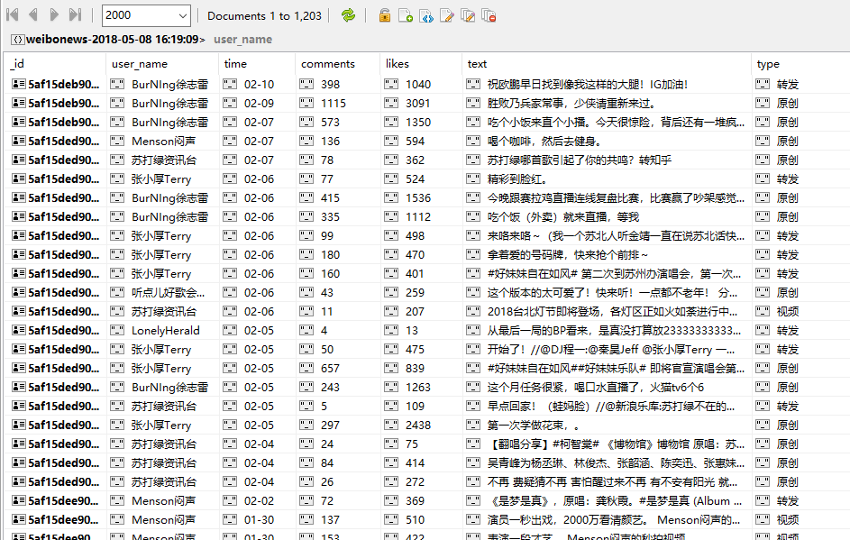

# Scrapy-weibo
The purpose of this project is to scrap the news of the users' weibo friends from m.weibo.com.
## 1 Preparation
Make sure to install Python 3.6, and MongoDB. 
Make sure to install the following libs: scrapy, pymongo.
## 2 Configuration
#### 2.1 Setup the request
    import scrapy

    class MobileSpider(scrapy.Spider):
        name = 'mobile'
        allowed_domains = ['weibo.cn']
        cookie = ''  # login and then populate cookie here
        cookies = {}
        for i in cookie.strip().split(';'):
            element = i.split('=')
            cookies[element[0].strip()] = element[1]
        headers = {
            'Host': 'm.weibo.cn',
            'Accept': 'application / json, text / javascript, * / *; q = 0.01',
            'Accept-Language': 'zh - CN, zh;q = 0.9, en;q = 0.8',
            'Accept-Encoding': 'gzip, deflate, br',
        }

        def start_requests(self):
            url = 'https://m.weibo.cn/feed/friends?version=v4'
            return [scrapy.Request(url, cookies=self.cookies, headers=self.headers, callback=self.parse)]
Simulate the Ajax request and call back parse method to parse the JSON content.
#### 2.2 Setup the pipelines
    import pymongo
    from scrapy.exceptions import DropItem

    class UsernameFilterPipeline(object):
        def process_item(self, item, spider):
            if not item.get('user_name'):
                raise DropItem('No User_name Item Found')
            else:
                return item

    class DuplicateFilterPipeline(object):
        def __init__(self):
            self.text_seen = set()

        def process_item(self, item, spider):
            if item.get('text') in self.text_seen:
                raise DropItem('Duplicate Item Found')
            else:
                self.text_seen.add(item.get('text'))
                return item

    class MongoPipeline(object):
        def __init__(self):
            self.client = pymongo.MongoClient('localhost', 27017)
            self.db = self.client['mydb']

        def spider_close(self, spider):
            self.client.close()

        def process_item(self, item, spider):
            self.db[item.collection].insert_one(dict(item))
            return item
Create pipelines to filter incomplete and duplicate items and then store the items into MongoDB.
#### 2.3 Enable pipelines in settings.py
    ITEM_PIPELINES = {
        'weibo.pipelines.UsernameFilterPipeline': 300,
        'weibo.pipelines.DuplicateFilterPipeline': 500,
        'weibo.pipelines.MongoPipeline': 800,
    }
# 3 Running result
Items are stored in MongoDB:

# 4 Summary
Scrapy only receive original HTML documents, but many webpages are rendered by JavaScript to generate contents that are not included in orginal HTML documents. So sometimes we fail to scarp the data which we see on the brower. Ajax technology is a common technology to render the webpape. To scrap the webpages loaded by Ajax technology, one method is to capture and analyze Ajax requests, then simulate Ajax requests in Scrapy. Note that mobile website are usually more easy to scrap than regular websites.